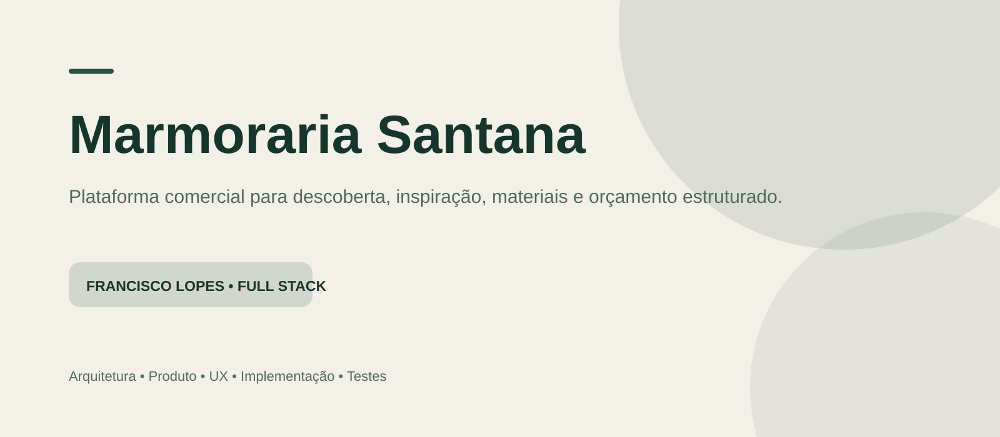

  

<h1 align="center">Marmoraria Santana</h1>

  Plataforma comercial para descoberta, inspiração, materiais e orçamento estruturado.

  
  
  
  
  

> **Status:** Prévia comercial desenvolvida para apresentação — código e dados de produção permanecem privados.

## Visão geral

Transformar uma presença digital tradicional em uma jornada comercial capaz de ajudar o visitante a descobrir materiais, explorar ambientes, se inspirar em projetos e chegar ao atendimento com contexto suficiente para iniciar um orçamento.

Este repositório é uma **vitrine técnica/documental**. O objetivo é demonstrar decisões de arquitetura, produto, UX e engenharia sem publicar código proprietário, credenciais, dados reais ou configurações internas.

<table>
<tr>
<td align="center"><strong>31</strong> páginas/rotas compiladas</td>
<td align="center"><strong>18/18</strong> cenários aprovados</td>
<td align="center"><strong>100</strong> acessibilidade na auditoria</td>
<td align="center"><strong>Preview</strong> noindex + validação</td>
</tr>
</table>

## Minha atuação

Atuação em **arquitetura, desenvolvimento full stack, integração, UX, validação, testes e refinamento da experiência**.

## Stack

Next.js • React • TypeScript • Tailwind CSS • React Hook Form • Zod • Supabase • Playwright

## Principais funcionalidades

- Exploração de materiais
- Projetos e ambientes em formato editorial
- Fluxo de orçamento em múltiplas etapas
- Persistência de intenção e contexto
- Upload de referências
- Integração contextual com WhatsApp
- Estrutura administrativa
- Autenticação e storage privado
- Modo preview com noindex
- Testes desktop e mobile

## Arquitetura

  

> O diagrama é propositalmente de alto nível para não expor detalhes sensíveis da implementação.

## Decisões técnicas

### Validação server-side
Dados enviados passam por validação antes da persistência.

### Storage privado
Referências e anexos são tratados em estrutura privada com acesso controlado.

### Preview seguro
A prévia permanece noindex e separa conteúdo confirmado de elementos ainda pendentes de validação.

### Jornada por intenção
A navegação parte de três intenções: projeto, escolha de material e inspiração.

## Screenshots

## Privacidade e confidencialidade

Este repositório **não contém**:

- código-fonte de produção;
- arquivos `.env`;
- chaves, tokens ou credenciais;
- banco de dados real;
- dados pessoais;
- configurações internas;
- segredos comerciais.

As imagens utilizadas aqui servem somente para apresentar o trabalho realizado e não devem ser reutilizadas como material oficial das empresas sem autorização.

## Autor

**Francisco Lopes de Sousa Filho**  
Desenvolvedor Full Stack

[GitHub](https://github.com/franciscolopesdev) • contactdevlps@gmail.com
